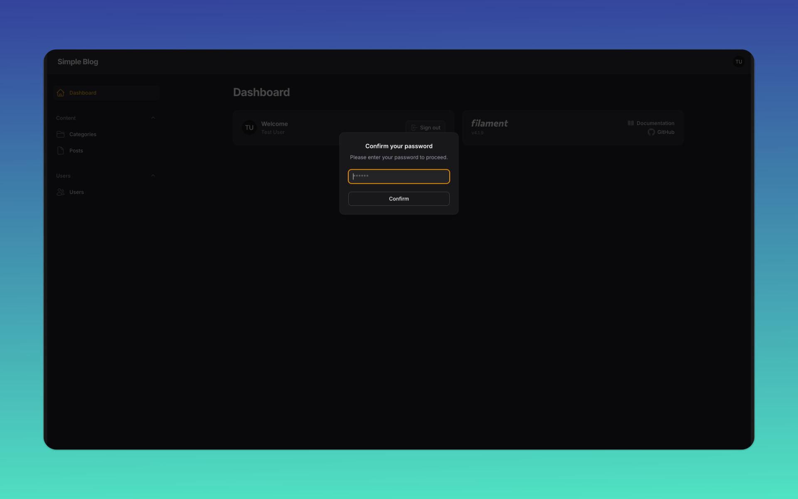

## Registering a global action in Filament



Sometimes, you need an [action](https://filamentphp.com/docs/4.x/actions/overview) in your Filament app that triggers no matter what page the user is on. Maybe you need to force an important confirmation or collect some required data before the user can continue.
That's where a global [modal action](https://filamentphp.com/docs/4.x/actions/modals#introduction) comes in.

## Getting Started

Follow the steps below to clone and install this project locally.

### Clone the repository
```bash
git clone https://github.com/wiremodel/simple-blog.git
cd simple-blog
git checkout v4/js-content
```

### Install PHP dependencies
```bash
composer install
```

### Install JavaScript dependencies
```bash
npm install
```

### Environment setup
- Copy the example environment file and generate the app key:
```bash
cp .env.example .env
php artisan key:generate
```

### Storage link (for public files like images)
```bash
php artisan storage:link
```

### Run migrations and seeders
This will create the tables and populate demo data (users, categories, posts, and 3 comments per post):
```bash
php artisan migrate --seed
```

If you need to reset everything and re-seed:
```bash
php artisan migrate:fresh --seed
```

### Build front-end assets
For local development (watches for changes):
```bash
npm run dev
```

### Serve the application
Using Laravel's built-in server:
```bash
php artisan serve
```
Visit http://127.0.0.1:8000 in your browser.

### Demo user

```text
test@example.com
```

```text
password
```
